# SCREENSHOT CHECKLIST

Capture these and insert them into `CAPSTONE_SUBMISSION_PACK.md` or a Word/PDF export.

## Core Product Proof
- 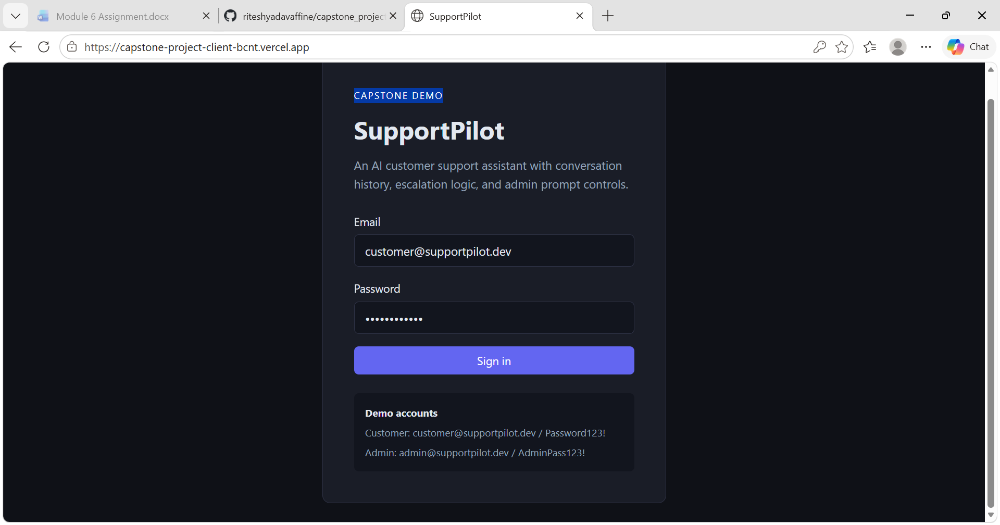]  — live login page on Vercel
- 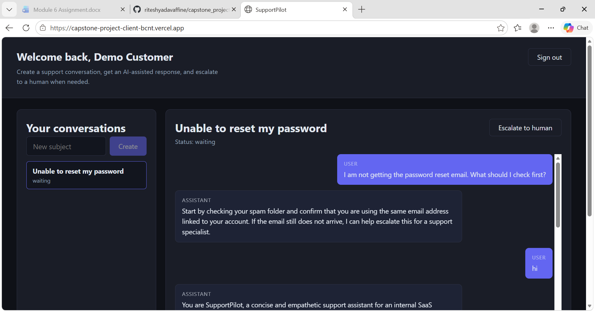 ]  — customer logged in
- 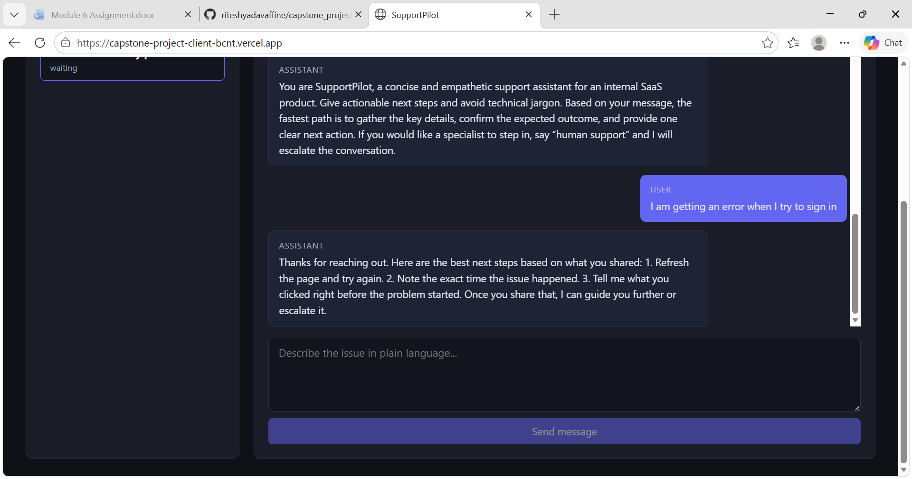 — user message + assistant response
-   — escalated conversation / escalation button action
-  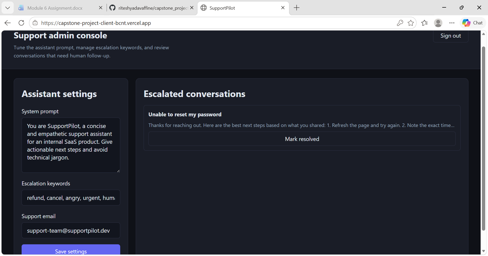  — admin logged in
-  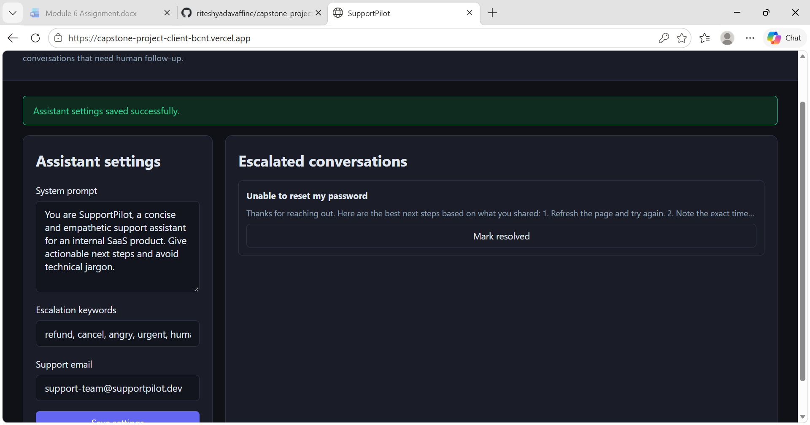 — success banner after settings update
-  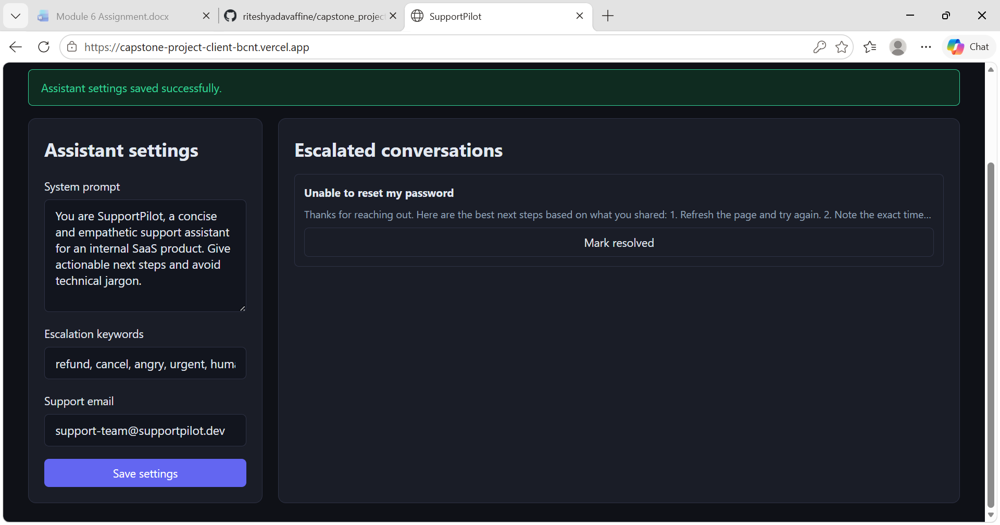— escalated queue visible to admin

## Change Request Proof
- 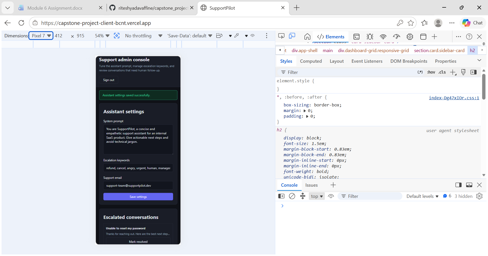  — mobile device mode view
- 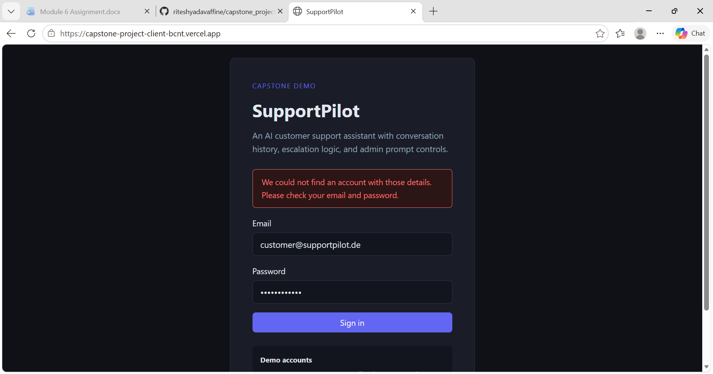 — clear, non-technical error message

## Engineering Proof
- 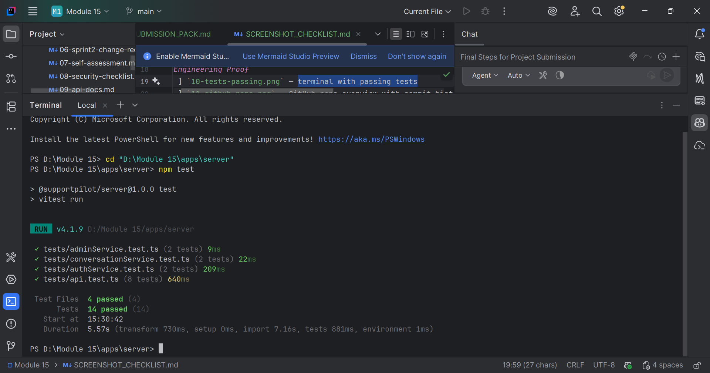  — terminal with passing tests
- 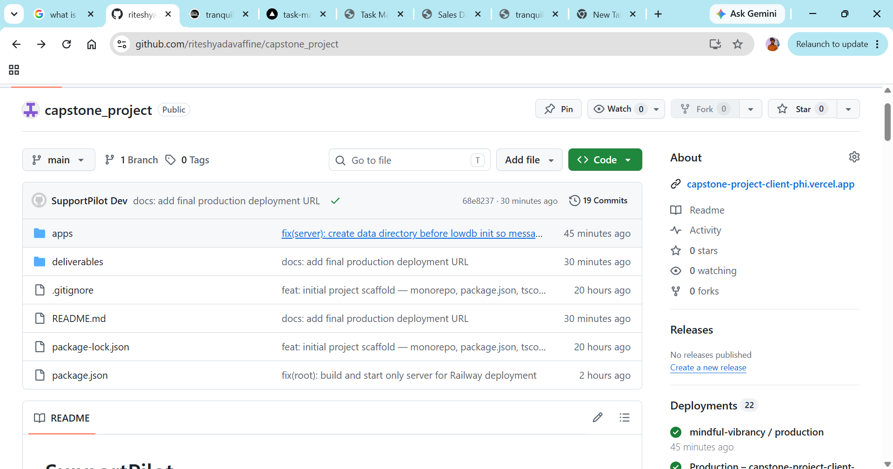 ` — GitHub repo overview with commit history
- 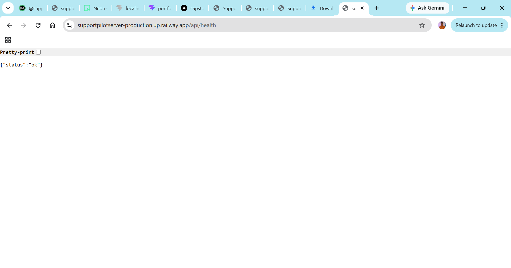  — backend health endpoint or Railway deployment status
